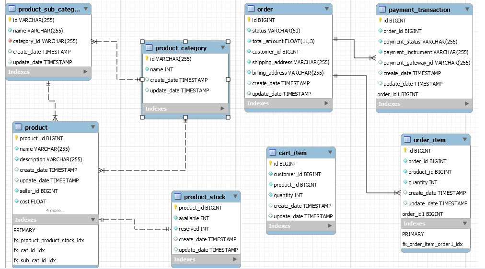
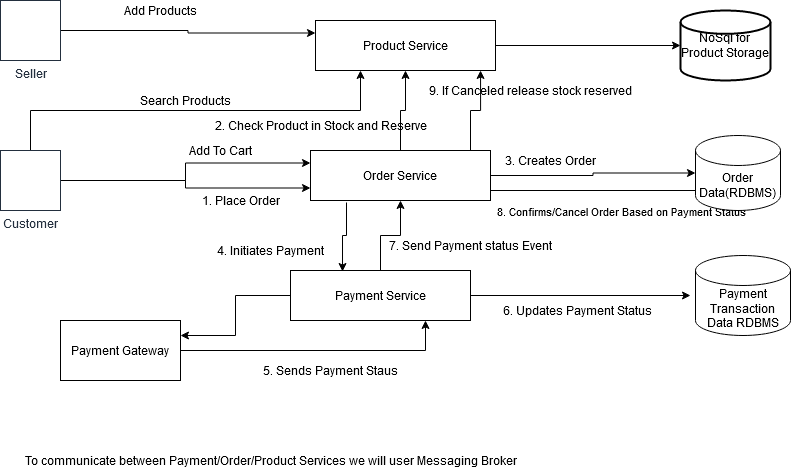

#### Setup
-  mvn clean install
- java -jar ecart-1.jar
- Swagger Apis at http://localhost:12000/ecart/swagger-ui.html#/

#### API Endpoints
- OrderController.java - Place order endpoints
- ShoppingCartController.java - Add Items to cart endpoints
- PaymentController.java - Receive Payment Event endpoints
- ProductController.java - Add and Search Product

#### Data Model
 

- product, product_category, product_subcategory tables will be in nosql database

### Flow

